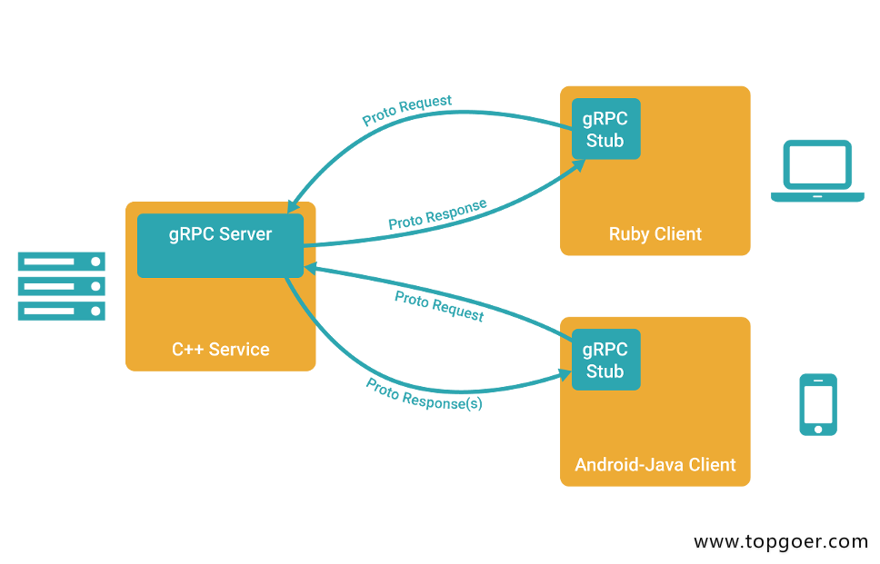
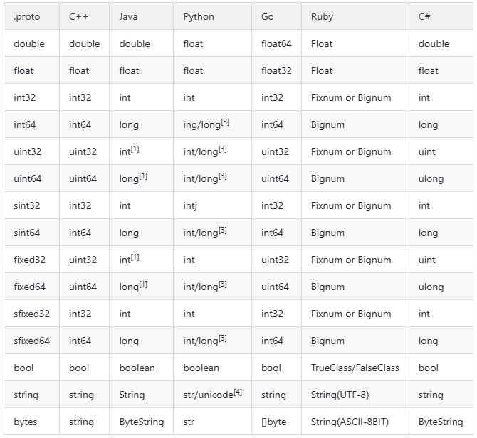

# GRPC

# 安装

## gPRC简介

- gRPC由google开发，是一款语言中立、平台中立、开源的远程过程调用系统
- gRPC客户端和服务端可以在多种环境中运行和交互，例如用java写一个服务端，可以用go语言写客户端调用

## gRPC与Protobuf介绍

- 微服务架构中，由于每个服务对应的代码库是独立运行的，无法直接调用，彼此间的通信就是个大问题
- gRPC可以实现微服务，将大的项目拆分为多个小且独立的业务模块，也就是服务，各服务间使用高效的protobuf协议进行RPC调用，gRPC默认使用protocol buffers，这是google开源的一套成熟的结构数据序列化机制（当然也可以使用其他数据格式如JSON）
- 可以用proto files创建gRPC服务，用message类型来定义方法参数和返回类型

# gRPC简介

[gRPC](https://grpc.io/) 是一个高性能、开源、通用的RPC框架，由Google推出，基于 [HTTP2](https://http2.github.io/) 协议标准设计开发，默认采用  [Protocol Buffers](https://protobuf.dev/)数据序列化协议，支持多种开发语言。gRPC提供了一种简单的方法来精确的定义服务，并且为客户端和服务端自动生成可靠的功能库。

在gRPC客户端可以直接调用不同服务器上的远程程序，使用姿势看起来就像调用本地程序一样，很容易去构建分布式应用和服务。和很多RPC系统一样，服务端负责实现定义好的接口并处理客户端的请求，客户端根据接口描述直接调用需要的服务。客户端和服务端可以分别使用gRPC支持的不同语言实现。




## 主要特性

- 强大的IDL

gRPC使用ProtoBuf来定义服务，ProtoBuf是由Google开发的一种数据序列化协议（类似于XML、JSON、hessian）。ProtoBuf能够将数据进行序列化，并广泛应用在数据存储、通信协议等方面。

- 多语言支持

gRPC支持多种语言，并能够基于语言自动生成客户端和服务端功能库。目前已提供了C版本grpc、Java版本grpc-java 和 Go版本grpc-go，其它语言的版本正在积极开发中，其中，grpc支持C、C++、Node.js、Python、Ruby、Objective-C、PHP和C#等语言，grpc-java已经支持Android开发。

- HTTP2

gRPC基于HTTP2标准设计，所以相对于其他RPC框架，gRPC带来了更多强大功能，如双向流、头部压缩、多复用请求等。这些功能给移动设备带来重大益处，如节省带宽、降低TCP链接次数、节省CPU使用和延长电池寿命等。同时，gRPC还能够提高了云端服务和Web应用的性能。gRPC既能够在客户端应用，也能够在服务器端应用，从而以透明的方式实现客户端和服务器端的通信和简化通信系统的构建。


更多介绍请查看[官方网站](https://grpc.io/)


# Protobuf⇢Go转换

这里使用一个测试文件对照说明常用结构的protobuf到golang的转换。只说明关键部分代码，详细内容请查看完整文件。

## Package 

在proto文件中使用`package`关键字声明包名，默认转换成go中的包名与此一致，如果需要指定不一样的包名，可以使用`go_package`选项：

```go
package test;
option go_package="test";
```

## Message

proto中的`message`对应go中的`struct`，全部使用驼峰命名规则。嵌套定义的`message`，`enum`转换为go之后，名称变为`Parent_Child`结构。


示例proto：

```go
// Test 测试
message Test {
    int32 age = 1;
    int64 count = 2;
    double money = 3;
    float score = 4;
    string name = 5;
    bool fat = 6;
    bytes char = 7;
    // Status 枚举状态
    enum Status {
        OK = 0;
        FAIL = 1;
    }
    Status status = 8;
    // Child 子结构
    message Child {
        string sex = 1;
    }
    Child child = 9;
    map<string, string> dict = 10;
}
```

转换结果:

```go
// Status 枚举状态
type Test_Status int32

const (
    Test_OK   Test_Status = 0
    Test_FAIL Test_Status = 1
)

// Test 测试
type Test struct {
    Age    int32       `protobuf:"varint,1,opt,name=age" json:"age,omitempty"`
    Count  int64       `protobuf:"varint,2,opt,name=count" json:"count,omitempty"`
    Money  float64     `protobuf:"fixed64,3,opt,name=money" json:"money,omitempty"`
    Score  float32     `protobuf:"fixed32,4,opt,name=score" json:"score,omitempty"`
    Name   string      `protobuf:"bytes,5,opt,name=name" json:"name,omitempty"`
    Fat    bool        `protobuf:"varint,6,opt,name=fat" json:"fat,omitempty"`
    Char   []byte      `protobuf:"bytes,7,opt,name=char,proto3" json:"char,omitempty"`
    Status Test_Status `protobuf:"varint,8,opt,name=status,enum=test.Test_Status" json:"status,omitempty"`
    Child  *Test_Child `protobuf:"bytes,9,opt,name=child" json:"child,omitempty"`
    Dict   map[string]string `protobuf:"bytes,10,rep,name=dict" json:"dict,omitempty" protobuf_key:"bytes,1,opt,name=key" protobuf_val:"bytes,2,opt,name=value"`
}

// Child 子结构
type Test_Child struct {
    Sex string `protobuf:"bytes,1,opt,name=sex" json:"sex,omitempty"`
}
```

除了会生成对应的结构外，还会有些工具方法，如字段的getter:

```go
func (m *Test) GetAge() int32 {
    if m != nil {
        return m.Age
    }
    return 0
}
```

枚举类型会生成对应名称的常量，同时会有两个map方便使用：

```go
var Test_Status_name = map[int32]string{
    0: "OK",
    1: "FAIL",
}
var Test_Status_value = map[string]int32{
    "OK":   0,
    "FAIL": 1,
}
```

## Service

定义一个简单的Service，`TestService`有一个方法`Test`，接收一个`Request`参数，返回`Response`:

```go
// TestService 测试服务
service TestService {
    // Test 测试方法
    rpc Test(Request) returns (Response) {};
}

// Request 请求结构
message Request {
    string name = 1;
}

// Response 响应结构
message Response {
    string message = 1;
}
```

转换结果:

```go
// 客户端接口
type TestServiceClient interface {
    // Test 测试方法
    Test(ctx context.Context, in *Request, opts ...grpc.CallOption) (*Response, error)
}

// 服务端接口
type TestServiceServer interface {
    // Test 测试方法
    Test(context.Context, *Request) (*Response, error)
}
```

生成的go代码中包含该Service定义的接口，客户端接口已经自动实现了，直接供客户端使用者调用，服务端接口需要由服务提供方实现。


# Protobuf语法

## 基本规范

- 文件以.proto做为文件后缀，除结构定义外的语句以分号结尾
- 结构定义可以包含：message、service、enum
- rpc方法定义结尾的分号可有可无
- Message命名采用驼峰命名方式，字段命名采用小写字母加下划线分隔方式

```go
message SongServerRequest {
      required string song_name = 1;
  }
```

- Enums类型名采用驼峰命名方式，字段命名采用大写字母加下划线分隔方式

```go
enum Foo {
      FIRST_VALUE = 1;
      SECOND_VALUE = 2;
  }
```

- Service与rpc方法名统一采用驼峰式命名


## 字段规则


- 字段格式：`限定修饰符 | 数据类型 | 字段名称 | = | 字段编码值 | [字段默认值]`
- 限定修饰符包含 required\optional\repeated
  - Required: 表示是一个必须字段，必须相对于发送方，在发送消息之前必须设置该字段的值，对于接收方，必须能够识别该字段的意思。发送之前没有设置required字段或者无法识别required字段都会引发编解码异常，导致消息被丢弃
  - Optional：表示是一个可选字段，可选对于发送方，在发送消息时，可以有选择性的设置或者不设置该字段的值。对于接收方，如果能够识别可选字段就进行相应的处理，如果无法识别，则忽略该字段，消息中的其它字段正常处理。—因为optional字段的特性，很多接口在升级版本中都把后来添加的字段都统一的设置为optional字段，这样老的版本无需升级程序也可以正常的与新的软件进行通信，只不过新的字段无法识别而已，因为并不是每个节点都需要新的功能，因此可以做到按需升级和平滑过渡
  - Repeated：表示该字段可以包含0~N个元素。其特性和optional一样，但是每一次可以包含多个值。可以看作是在传递一个数组的值
- 数据类型
  - Protobuf定义了一套基本数据类型。几乎都可以映射到C++\Java等语言的基础数据类型




```
+ N 表示打包的字节并不是固定。而是根据数据的大小或者长度
+ 关于 fixed32 和int32的区别。fixed32的打包效率比int32的效率高，但是使用的空间一般比int32多。因此一个属于时间效率高，一个属于空间效率高
```

- 字段名称
  - 字段名称的命名与C、C++、Java等语言的变量命名方式几乎是相同的
  - protobuf建议字段的命名采用以下划线分割的驼峰式。例如 first_name 而不是firstName
- 字段编码值
  - 有了该值，通信双方才能互相识别对方的字段，相同的编码值，其限定修饰符和数据类型必须相同，编码值的取值范围为 1~2^32（4294967296）
  - 其中 1~15的编码时间和空间效率都是最高的，编码值越大，其编码的时间和空间效率就越低，所以建议把经常要传递的值把其字段编码设置为1-15之间的值
  - 1900~2000编码值为Google protobuf 系统内部保留值，建议不要在自己的项目中使用
- 字段默认值
  - 当在传递数据时，对于required数据类型，如果用户没有设置值，则使用默认值传递到对端


## service如何定义

- 如果想要将消息类型用在RPC系统中，可以在.proto文件中定义一个RPC服务接口，protocol buffer编译器会根据所选择的不同语言生成服务接口代码
- 例如，想要定义一个RPC服务并具有一个方法，该方法接收SearchRequest并返回一个SearchResponse，此时可以在.proto文件中进行如下定义：

```go
service SearchService {
        rpc Search (SearchRequest) returns (SearchResponse) {}
    }
```


- 生成的接口代码作为客户端与服务端的约定，服务端必须实现定义的所有接口方法，客户端直接调用同名方法向服务端发起请求，比较麻烦的是，即便业务上不需要参数也必须指定一个请求消息，一般会定义一个空message


## Message如何定义

- 一个message类型定义描述了一个请求或响应的消息格式，可以包含多种类型字段
- 例如定义一个搜索请求的消息格式，每个请求包含查询字符串、页码、每页数目
- 字段名用小写，转为go文件后自动变为大写，message就相当于结构体

```go
    syntax = "proto3";

    message SearchRequest {
        string query = 1;            // 查询字符串
        int32  page_number = 2;     // 页码
        int32  result_per_page = 3;   // 每页条数
    }
```

- 首行声明使用的protobuf版本为proto3
- SearchRequest 定义了三个字段，每个字段声明以分号结尾，.proto文件支持双斜线 // 添加单行注释

## 添加更多Message类型

- 一个.proto文件中可以定义多个消息类型，一般用于同时定义多个相关的消息，例如在同一个.proto文件中同时定义搜索请求和响应消息

```go
    syntax = "proto3";

    // SearchRequest 搜索请求
    message SearchRequest {
        string query = 1;            // 查询字符串
        int32  page_number = 2;     // 页码
        int32  result_per_page = 3;   // 每页条数
    }

    // SearchResponse 搜索响应
    message SearchResponse {
        ...
    }
```


## 如何使用其他Message

- message支持嵌套使用，作为另一message中的字段类型

```go
 message SearchResponse {
        repeated Result results = 1;
    }

    message Result {
        string url = 1;
        string title = 2;
        repeated string snippets = 3;
    }
```

## Message嵌套的使用


- 支持嵌套消息，消息可以包含另一个消息作为其字段。也可以在消息内定义一个新的消息
- 内部声明的message类型名称只可在内部直接使用

```go
    message SearchResponse {
        message Result {
            string url = 1;
            string title = 2;
            repeated string snippets = 3;
        }
        repeated Result results = 1;
    }
```

- 另外，还可以多层嵌套


```go
    message Outer {                // Level 0
        message MiddleAA {        // Level 1
            message Inner {        // Level 2
                int64 ival = 1;
                bool  booly = 2;
            }
        }
        message MiddleBB {         // Level 1
            message Inner {         // Level 2
                int32 ival = 1;
                bool  booly = 2;
            }
        }
    }
```

## proto3的Map类型

- proto3支持map类型声明

```go
    map<key_type, value_type> map_field = N;

    message Project {...}
    map<string, Project> projects = 1;
```

- 键、值类型可以是内置的类型，也可以是自定义message类型
- 字段不支持repeated属性


## .proto文件编译

- 通过定义好的.proto文件生成Java, Python, C++, Go, Ruby, JavaNano, Objective-C, or C# 代码，需要安装编译器protoc
- 当使用protocol buffer编译器运行.proto文件时，编译器将生成所选语言的代码，用于使用在.proto文件中定义的消息类型、服务接口约定等。不同语言生成的代码格式不同：
  - C++: 每个.proto文件生成一个.h文件和一个.cc文件，每个消息类型对应一个类
  - Java: 生成一个.java文件，同样每个消息对应一个类，同时还有一个特殊的Builder类用于创建消息接口
  - Python: 姿势不太一样，每个.proto文件中的消息类型生成一个含有静态描述符的模块，该模块与一个元类metaclass在运行时创建需要的Python数据访问类
  - Go: 生成一个.pb.go文件，每个消息类型对应一个结构体
  - Ruby: 生成一个.rb文件的Ruby模块，包含所有消息类型
  - JavaNano: 类似Java，但不包含Builder类
  - Objective-C: 每个.proto文件生成一个pbobjc.h和一个pbobjc.m文件
  - C#: 生成.cs文件包含，每个消息类型对应一个类


## import导入定义

- 可以使用import语句导入使用其它描述文件中声明的类型
- protobuf 接口文件可以像C语言的h文件一个，分离为多个，在需要的时候通过 import导入需要对文件。其行为和C语言的#include或者java的import的行为大致相同，例如import “others.proto”;
- protocol buffer编译器会在 -I / –proto_path参数指定的目录中查找导入的文件，如果没有指定该参数，默认在当前目录中查找


## 包的使用

- 在.proto文件中使用package声明包名，避免命名冲突

```go
syntax = "proto3";
package foo.bar;
message Open {...}
```

- 在其他的消息格式定义中可以使用包名+消息名的方式来使用类型，如

```go
message Foo {
    ...
    foo.bar.Open open = 1;
    ...
}
```

- 在不同的语言中，包名定义对编译后生成的代码的影响不同
  - C++ 中：对应C++命名空间，例如Open会在命名空间foo::bar中
  - Java 中：package会作为Java包名，除非指定了option jave_package选项
  - Python 中：package被忽略
  - Go 中：默认使用package名作为包名，除非指定了option go_package选项
  - JavaNano 中：同Java
  - C# 中：package会转换为驼峰式命名空间，如Foo.Bar,除非指定了option csharp_namespace选项


# 小案例

按照惯例，这里也从一个Hello项目开始，本项目定义了一个Hello Service，客户端发送包含字符串名字的请求，服务端返回Hello消息。

*流程*:

1. 编写`.proto`描述文件
2. 编译生成`.pb.go`文件
3. 服务端实现约定的接口并提供服务
4. 客户端按照约定调用`.pb.go`文件中的方法请求服务


*项目结构*:

```go
|—— hello/
    |—— client/
        |—— main.go   // 客户端
    |—— server/
        |—— main.go   // 服务端
|—— proto/
    |—— hello/
        |—— hello.proto   // proto描述文件
        |—— hello.pb.go   // proto编译后文件

```


*Step1: 编写描述文件: hello.proto*

```go
syntax = "proto3"; // 指定proto版本
package hello;     // 指定默认包名

// 指定golang包名
option go_package = "hello";

// 定义Hello服务
service Hello {
    // 定义SayHello方法
    rpc SayHello(HelloRequest) returns (HelloResponse) {}
}

// HelloRequest 请求结构
message HelloRequest {
    string name = 1;
}

// HelloResponse 响应结构
message HelloResponse {
    string message = 1;
}
```

`hello.proto`文件中定义了一个Hello Service，该服务包含一个`SayHello`方法，同时声明了`HelloRequest`和`HelloResponse`消息结构用于请求和响应。客户端使用`HelloRequest`参数调用`SayHello`方法请求服务端，服务端响应`HelloResponse`消息。一个最简单的服务就定义好了。


*Step2: 编译生成`.pb.go`文件*

```bash
$ cd proto/hello

# 编译hello.proto
$ protoc -I . --go_out=plugins=grpc:. ./hello.proto
```

在当前目录内生成的`hello.pb.go`文件，按照`.proto`文件中的说明，包含服务端接口`HelloServer`描述，客户端接口及实现`HelloClient`，及`HelloRequest`、`HelloResponse`结构体。


```
注意：不要手动编辑该文件
```

*Step3: 实现服务端接口`server/main.go`*

```go
package main

import (
    "fmt"
    "net"

    pb "github.com/jergoo/go-grpc-example/proto/hello" // 引入编译生成的包
    "golang.org/x/net/context"
    "google.golang.org/grpc"
    "google.golang.org/grpc/grpclog"
)

const (
    // Address gRPC服务地址
    Address = "127.0.0.1:50052"
)

// 定义helloService并实现约定的接口
type helloService struct{}

// HelloService Hello服务
var HelloService = helloService{}

// SayHello 实现Hello服务接口
func (h helloService) SayHello(ctx context.Context, in *pb.HelloRequest) (*pb.HelloResponse, error) {
    resp := new(pb.HelloResponse)
    resp.Message = fmt.Sprintf("Hello %s.", in.Name)

    return resp, nil
}

func main() {
    listen, err := net.Listen("tcp", Address)
    if err != nil {
        grpclog.Fatalf("Failed to listen: %v", err)
    }

    // 实例化grpc Server
    s := grpc.NewServer()

    // 注册HelloService
    pb.RegisterHelloServer(s, HelloService)

    grpclog.Println("Listen on " + Address)
    s.Serve(listen)
}
```

服务端引入编译后的`proto`包，定义一个空结构用于实现约定的接口，接口描述可以查看`hello.pb.go`文件中的`HelloServer`接口描述。实例化grpc Server并注册HelloService，开始提供服务。

运行：


```bash
$ go run main.go
Listen on 127.0.0.1:50052  //服务端已开启并监听50052端口
```


*Step4: 实现客户端调用`client/main.go`*

```go
package main

import (
    pb "github.com/jergoo/go-grpc-example/proto/hello" // 引入proto包
    "golang.org/x/net/context"
    "google.golang.org/grpc"
    "google.golang.org/grpc/grpclog"
)

const (
    // Address gRPC服务地址
    Address = "127.0.0.1:50052"
)

func main() {
    // 连接
    conn, err := grpc.Dial(Address, grpc.WithInsecure())
    if err != nil {
        grpclog.Fatalln(err)
    }
    defer conn.Close()

    // 初始化客户端
    c := pb.NewHelloClient(conn)

    // 调用方法
    req := &pb.HelloRequest{Name: "gRPC"}
    res, err := c.SayHello(context.Background(), req)

    if err != nil {
        grpclog.Fatalln(err)
    }

    grpclog.Println(res.Message)
}
```


客户端初始化连接后直接调用`hello.pb.go`中实现的`SayHello`方法，即可向服务端发起请求，使用姿势就像调用本地方法一样。

运行：

```bash
$ go run main.go
Hello gRPC.    // 接收到服务端响应
```

```
建议到这里仔细看一看hello.pb.go文件中的内容，对比hello.proto文件，理解protobuf中的定义转换为golang后的结构。
```


# OpenSSL安装

官方下载地址: [https://openssl-library.org/source/](https://openssl-library.org/source/)


# 认证

gRPC默认内置了两种认证方式：

- SSL/TLS认证方式

- 基于Token的认证方式

同时，gRPC提供了接口用于扩展自定义认证方式


## TLS认证示例


这里直接扩展hello项目，实现TLS认证机制

首先需要准备证书，在hello目录新建keys目录用于存放证书文件。

### 证书制作

### 制作私钥(.key)

```bash
# Key considerations for algorithm "RSA" ≥ 2048-bit
$ openssl genrsa -out server.key 2048

# Key considerations for algorithm "ECDSA" ≥ secp384r1
# List ECDSA the supported curves (openssl ecparam -list_curves)
$ openssl ecparam -genkey -name secp384r1 -out server.key
```

### 自签名公钥(x509) (PEM-encodings `.pem`|`.crt`)


```go
$ openssl req -new -x509 -sha256 -key server.key -out server.pem -days 3650
```


### 自定义信息

```go
-----
Country Name (2 letter code) [AU]:CN  //这个是中国的缩写
State or Province Name (full name) [Some-State]:XxXx  //省份
Locality Name (eg, city) []:XxXx  //城市
Organization Name (eg, company) [Internet Widgits Pty Ltd]:XX Co. Ltd  //公司名称
Organizational Unit Name (eg, section) []:Dev   //部门名称
Common Name (e.g. server FQDN or YOUR name) []:server name   //服务名称 例如www.topgoer.com
Email Address []:xxx@xxx.com  //邮箱地址
```


### 目录结构

```go
|—— hello-tls/
    |—— client/
        |—— main.go   // 客户端
    |—— server/
        |—— main.go   // 服务端
|—— keys/                 // 证书目录
    |—— server.key
    |—— server.pem
|—— proto/
    |—— hello/
        |—— hello.proto   // proto描述文件
        |—— hello.pb.go   // proto编译后文件
```

### 示例代码

`proto/helloworld.proto`及`proto/hello.pb.go`文件不需要改动

修改服务端代码：server/main.go


```go
package main

import (
  "fmt"
  "net"

  pb "github.com/jergoo/go-grpc-example/proto/hello"

  "golang.org/x/net/context"
  "google.golang.org/grpc"
  "google.golang.org/grpc/credentials" // 引入grpc认证包
  "google.golang.org/grpc/grpclog"
)

const (
  // Address gRPC服务地址
  Address = "127.0.0.1:50052"
)

// 定义helloService并实现约定的接口
type helloService struct{}

// HelloService Hello服务
var HelloService = helloService{}

// SayHello 实现Hello服务接口
func (h helloService) SayHello(ctx context.Context, in *pb.HelloRequest) (*pb.HelloResponse, error) {
  resp := new(pb.HelloResponse)
  resp.Message = fmt.Sprintf("Hello %s.", in.Name)

  return resp, nil
}

func main() {
  listen, err := net.Listen("tcp", Address)
  if err != nil {
    grpclog.Fatalf("Failed to listen: %v", err)
  }

  // TLS认证
  creds, err := credentials.NewServerTLSFromFile("../../keys/server.pem", "../../keys/server.key")
  if err != nil {
    grpclog.Fatalf("Failed to generate credentials %v", err)
  }

  // 实例化grpc Server, 并开启TLS认证
  s := grpc.NewServer(grpc.Creds(creds))

  // 注册HelloService
  pb.RegisterHelloServer(s, HelloService)

  grpclog.Println("Listen on " + Address + " with TLS")

  s.Serve(listen)
}
```


运行:

```bash
$ go run main.go

Listen on 127.0.0.1:50052 with TLS
```

服务端在实例化grpc Server时，可配置多种选项，TLS认证是其中之一

客户端添加TLS认证：client/main.go


```go
package main

import (
    pb "github.com/jergoo/go-grpc-example/proto/hello" // 引入proto包

    "golang.org/x/net/context"
    "google.golang.org/grpc"
    "google.golang.org/grpc/credentials" // 引入grpc认证包
    "google.golang.org/grpc/grpclog"
)

const (
    // Address gRPC服务地址
    Address = "127.0.0.1:50052"
)

func main() {
    // TLS连接  记得把server name改成你写的服务器地址
    creds, err := credentials.NewClientTLSFromFile("../../keys/server.pem", "server name")
    if err != nil {
        grpclog.Fatalf("Failed to create TLS credentials %v", err)
    }

    conn, err := grpc.Dial(Address, grpc.WithTransportCredentials(creds))
    if err != nil {
        grpclog.Fatalln(err)
    }
    defer conn.Close()

    // 初始化客户端
    c := pb.NewHelloClient(conn)

    // 调用方法
    req := &pb.HelloRequest{Name: "gRPC"}
    res, err := c.SayHello(context.Background(), req)
    if err != nil {
        grpclog.Fatalln(err)
    }

    grpclog.Println(res.Message)
}
```

运行:

```bash
$ go run main.go

Hello gRPC
```

客户端添加TLS认证的方式和服务端类似，在创建连接`Dial`时，同样可以配置多种选项，后面的示例中会看到更多的选项。

## Token认证示例

再进一步，继续扩展hello-tls项目，实现TLS + Token认证机制


### 目录结构

```go
|—— hello_token/
    |—— client/
        |—— main.go   // 客户端
    |—— server/
        |—— main.go   // 服务端
|—— keys/             // 证书目录
    |—— server.key
    |—— server.pem
|—— proto/
    |—— hello/
        |—— hello.proto   // proto描述文件
        |—— hello.pb.go   // proto编译后文件
```

### 示例代码

先修改客户端实现：client/main.go

```go
package main

import (
    pb "github.com/jergoo/go-grpc-example/proto/hello" // 引入proto包

    "golang.org/x/net/context"
    "google.golang.org/grpc"
    "google.golang.org/grpc/credentials" // 引入grpc认证包
    "google.golang.org/grpc/grpclog"
)

const (
    // Address gRPC服务地址
    Address = "127.0.0.1:50052"

    // OpenTLS 是否开启TLS认证
    OpenTLS = true
)

// customCredential 自定义认证
type customCredential struct{}

// GetRequestMetadata 实现自定义认证接口
func (c customCredential) GetRequestMetadata(ctx context.Context, uri ...string) (map[string]string, error) {
    return map[string]string{
        "appid":  "101010",
        "appkey": "i am key",
    }, nil
}

// RequireTransportSecurity 自定义认证是否开启TLS
func (c customCredential) RequireTransportSecurity() bool {
    return OpenTLS
}

func main() {
    var err error
    var opts []grpc.DialOption

    if OpenTLS {
        // TLS连接
        creds, err := credentials.NewClientTLSFromFile("../../keys/server.pem", "server name")
        if err != nil {
            grpclog.Fatalf("Failed to create TLS credentials %v", err)
        }
        opts = append(opts, grpc.WithTransportCredentials(creds))
    } else {
        opts = append(opts, grpc.WithInsecure())
    }

    // 使用自定义认证
    opts = append(opts, grpc.WithPerRPCCredentials(new(customCredential)))

    conn, err := grpc.Dial(Address, opts...)

    if err != nil {
        grpclog.Fatalln(err)
    }

    defer conn.Close()

    // 初始化客户端
    c := pb.NewHelloClient(conn)

    // 调用方法
    req := &pb.HelloRequest{Name: "gRPC"}
    res, err := c.SayHello(context.Background(), req)
    if err != nil {
        grpclog.Fatalln(err)
    }

    grpclog.Println(res.Message)
}
```


这里我们定义了一个`customCredential`结构，并实现了两个方法`GetRequestMetadata`和`RequireTransportSecurity`。这是gRPC提供的自定义认证方式，每次RPC调用都会传输认证信息。`customCredential`其实是实现了`grpc/credential`包内的`PerRPCCredentials`接口。每次调用，token信息会通过请求的metadata传输到服务端。下面具体看一下服务端如何获取metadata中的信息。


修改server/main.go中的SayHello方法：


```go
package main

import (
    "fmt"
    "net"

    pb "github.com/jergoo/go-grpc-example/proto/hello"

    "golang.org/x/net/context"
    "google.golang.org/grpc"
    "google.golang.org/grpc/codes"
    "google.golang.org/grpc/credentials" // 引入grpc认证包
    "google.golang.org/grpc/grpclog"
    "google.golang.org/grpc/metadata" // 引入grpc meta包
)

const (
    // Address gRPC服务地址
    Address = "127.0.0.1:50052"
)

// 定义helloService并实现约定的接口
type helloService struct{}

// HelloService ...
var HelloService = helloService{}

// SayHello 实现Hello服务接口
func (h helloService) SayHello(ctx context.Context, in *pb.HelloRequest) (*pb.HelloResponse, error) {
    // 解析metada中的信息并验证
    md, ok := metadata.FromContext(ctx)
    if !ok {
        return nil, grpc.Errorf(codes.Unauthenticated, "无Token认证信息")
    }

    var (
        appid  string
        appkey string
    )

    if val, ok := md["appid"]; ok {
        appid = val[0]
    }

    if val, ok := md["appkey"]; ok {
        appkey = val[0]
    }

    if appid != "101010" || appkey != "i am key" {
        return nil, grpc.Errorf(codes.Unauthenticated, "Token认证信息无效: appid=%s, appkey=%s", appid, appkey)
    }

    resp := new(pb.HelloResponse)
    resp.Message = fmt.Sprintf("Hello %s.\nToken info: appid=%s,appkey=%s", in.Name, appid, appkey)

    return resp, nil
}

func main() {
    listen, err := net.Listen("tcp", Address)
    if err != nil {
        grpclog.Fatalf("failed to listen: %v", err)
    }

    // TLS认证
    creds, err := credentials.NewServerTLSFromFile("../../keys/server.pem", "../../keys/server.key")
    if err != nil {
        grpclog.Fatalf("Failed to generate credentials %v", err)
    }

    // 实例化grpc Server, 并开启TLS认证
    s := grpc.NewServer(grpc.Creds(creds))

    // 注册HelloService
    pb.RegisterHelloServer(s, HelloService)

    grpclog.Println("Listen on " + Address + " with TLS + Token")

    s.Serve(listen)
}
```

服务端可以从`context`中获取每次请求的metadata，从中读取客户端发送的token信息并验证有效性。

运行：

```bash
$ go run main.go

Listen on 50052 with TLS + Token
```

运行客户端程序 client/main.go：

```bash
$ go run main.go

// 认证成功结果
Hello gRPC
Token info: appid=101010,appkey=i am key

// 修改key验证认证失败结果：
rpc error: code = 16 desc = Token认证信息无效: appID=101010, appKey=i am not key
```

`google.golang.org/grpc/credentials/oauth`包已实现了用于Google API的oauth和jwt验证的方法，使用方法可以参考 [官方文档](https://github.com/grpc/grpc-go/blob/master/Documentation/grpc-auth-support.md)  。在实际应用中，我们可以根据自己的业务需求实现合适的验证方式。


# 拦截器

grpc服务端和客户端都提供了interceptor功能，功能类似middleware，很适合在这里处理验证、日志等流程。

在自定义Token认证的示例中，认证信息是由每个服务中的方法处理并认证的，如果有大量的接口方法，这种姿势就太不优雅了，每个接口实现都要先处理认证信息。这个时候interceptor就可以用来解决了这个问题，在请求被转到具体接口之前处理认证信息，一处认证，到处无忧。
在客户端，我们增加一个请求日志，记录请求相关的参数和耗时等等。修改hello_token项目实现：


## 目录结构


```go
|—— hello_interceptor/
    |—— client/
        |—— main.go   // 客户端
    |—— server/
        |—— main.go   // 服务端
|—— keys/             // 证书目录
    |—— server.key
    |—— server.pem
|—— proto/
    |—— hello/
        |—— hello.proto   // proto描述文件
        |—— hello.pb.go   // proto编译后文件
```


## 示例代码

*Step 1.服务端interceptor*

```
hello_interceptor/server/main.go
```


```go
package main

import (
    "fmt"
    "net"

    pb "github.com/jergoo/go-grpc-example/proto/hello"

    "golang.org/x/net/context"
    "google.golang.org/grpc"
    "google.golang.org/grpc/codes"       // grpc 响应状态码
    "google.golang.org/grpc/credentials" // grpc认证包
    "google.golang.org/grpc/grpclog"
    "google.golang.org/grpc/metadata" // grpc metadata包
)

const (
    // Address gRPC服务地址
    Address = "127.0.0.1:50052"
)

// 定义helloService并实现约定的接口
type helloService struct{}

// HelloService Hello服务
var HelloService = helloService{}

// SayHello 实现Hello服务接口
func (h helloService) SayHello(ctx context.Context, in *pb.HelloRequest) (*pb.HelloResponse, error) {
    resp := new(pb.HelloResponse)
    resp.Message = fmt.Sprintf("Hello %s.", in.Name)

    return resp, nil
}

func main() {
    listen, err := net.Listen("tcp", Address)
    if err != nil {
        grpclog.Fatalf("Failed to listen: %v", err)
    }

    var opts []grpc.ServerOption

    // TLS认证
    creds, err := credentials.NewServerTLSFromFile("../../keys/server.pem", "../../keys/server.key")
    if err != nil {
        grpclog.Fatalf("Failed to generate credentials %v", err)
    }

    opts = append(opts, grpc.Creds(creds))

    // 注册interceptor
    opts = append(opts, grpc.UnaryInterceptor(interceptor))

    // 实例化grpc Server
    s := grpc.NewServer(opts...)

    // 注册HelloService
    pb.RegisterHelloServer(s, HelloService)

    grpclog.Println("Listen on " + Address + " with TLS + Token + Interceptor")

    s.Serve(listen)
}

// auth 验证Token
func auth(ctx context.Context) error {
    md, ok := metadata.FromContext(ctx)
    if !ok {
        return grpc.Errorf(codes.Unauthenticated, "无Token认证信息")
    }

    var (
        appid  string
        appkey string
    )

    if val, ok := md["appid"]; ok {
        appid = val[0]
    }

    if val, ok := md["appkey"]; ok {
        appkey = val[0]
    }

    if appid != "101010" || appkey != "i am key" {
        return grpc.Errorf(codes.Unauthenticated, "Token认证信息无效: appid=%s, appkey=%s", appid, appkey)
    }

    return nil
}

// interceptor 拦截器
func interceptor(ctx context.Context, req interface{}, info *grpc.UnaryServerInfo, handler grpc.UnaryHandler) (interface{}, error) {
    err := auth(ctx)
    if err != nil {
        return nil, err
    }
    // 继续处理请求
    return handler(ctx, req)
}
```


*Step 2.实现客户端interceptor*

```
hello_intercepror/client/main.go
```

```go
package main

import (
    "time"

    pb "github.com/jergoo/go-grpc-example/proto/hello" // 引入proto包

    "golang.org/x/net/context"
    "google.golang.org/grpc"
    "google.golang.org/grpc/credentials" // 引入grpc认证包
    "google.golang.org/grpc/grpclog"
)

const (
    // Address gRPC服务地址
    Address = "127.0.0.1:50052"

    // OpenTLS 是否开启TLS认证
    OpenTLS = true
)

// customCredential 自定义认证
type customCredential struct{}

// GetRequestMetadata 实现自定义认证接口
func (c customCredential) GetRequestMetadata(ctx context.Context, uri ...string) (map[string]string, error) {
    return map[string]string{
        "appid":  "101010",
        "appkey": "i am key",
    }, nil
}

// RequireTransportSecurity 自定义认证是否开启TLS
func (c customCredential) RequireTransportSecurity() bool {
    return OpenTLS
}

func main() {
    var err error
    var opts []grpc.DialOption

    if OpenTLS {
        // TLS连接
        creds, err := credentials.NewClientTLSFromFile("../../keys/server.pem", "server name")
        if err != nil {
            grpclog.Fatalf("Failed to create TLS credentials %v", err)
        }
        opts = append(opts, grpc.WithTransportCredentials(creds))
    } else {
        opts = append(opts, grpc.WithInsecure())
    }

    // 指定自定义认证
    opts = append(opts, grpc.WithPerRPCCredentials(new(customCredential)))
    // 指定客户端interceptor
    opts = append(opts, grpc.WithUnaryInterceptor(interceptor))

    conn, err := grpc.Dial(Address, opts...)
    if err != nil {
        grpclog.Fatalln(err)
    }
    defer conn.Close()

    // 初始化客户端
    c := pb.NewHelloClient(conn)

    // 调用方法
    req := &pb.HelloRequest{Name: "gRPC"}
    res, err := c.SayHello(context.Background(), req)
    if err != nil {
        grpclog.Fatalln(err)
    }

    grpclog.Println(res.Message)
}

// interceptor 客户端拦截器
func interceptor(ctx context.Context, method string, req, reply interface{}, cc *grpc.ClientConn, invoker grpc.UnaryInvoker, opts ...grpc.CallOption) error {
    start := time.Now()
    err := invoker(ctx, method, req, reply, cc, opts...)
    grpclog.Printf("method=%s req=%v rep=%v duration=%s error=%v\n", method, req, reply, time.Since(start), err)
    return err
}
```


## 运行结果

```bash
$ cd hello_inteceptor/server && go run main.go
Listen on 127.0.0.1:50052 with TLS + Token + Interceptor
```

```bash
$ cd hello_inteceptor/client && go run main.go
method=/hello.Hello/SayHello req=name:"gRPC"  rep=message:"Hello gRPC."  duration=33.879699ms error=<nil>

Hello gRPC.
```

*项目推荐*: [go-grpc-middleware](https://github.com/grpc-ecosystem/go-grpc-middleware)


这个项目对interceptor进行了封装，支持多个拦截器的链式组装，对于需要多种处理的地方使用起来会更方便些。

# 内置Trace


